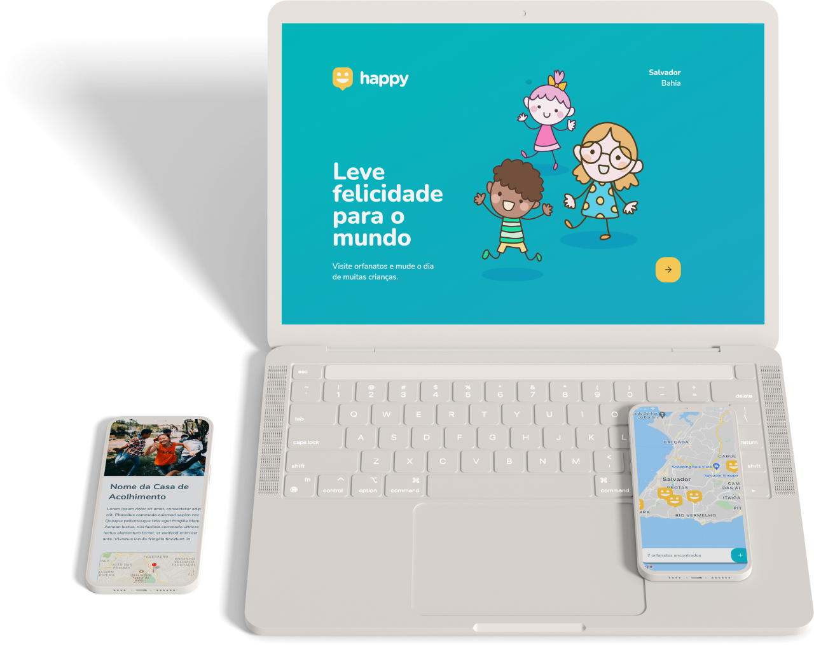

<h1 align="center">
    
</h1>
<h2 align="center">
    :boy: NextLevelWeek 3.0 :girl:
</h2>

<p align="center">
  
  
  <a href="https://github.com/GabrielReira/Happy-Project/commits/main">
    
  </a>
  <a href="https://github.com/GabrielReira">
    
  </a>
  <a href="https://github.com/GabrielReira/Happy-Project/blob/master/LICENSE">
    
  </a>
</p>

<br>

---

## :computer: Sobre o projeto
### Informações gerais
<p>Happy é uma aplicação web e mobile que facilita a conexão de pessoas a casas de acolhimento institucionais.</p>
<p>É uma aplicação que pode ser customizada para cada cidade e possui uso bastante simples: cadastrar orfanatos e possibilitar que outras pessoas saibam se existe alguma casa de acolhimento próximo a casa dela em que ela possa visitar, saber o que pode e não levar e seu horário de funcionamento.</p>
<p>Projeto desenvolvido na trilha <strong>OmniStack</strong> da <strong>Next Level Week</strong>, organizada pela <a href="https://rocketseat.com.br/">Rocketseat</a>.</p>

### Informações técnicas
<p>
  No React, toda interface é criada de maneira mais flexível. Uma das coisas mais importantes que o React oferece é a facilidade durante a construção da <strong>SPA</strong> (Single-Page Application). SPA é uma aplicação em que nós conseguimos alterar o conteúdo de uma página sem precisar carregá-la do zero toda vez que o usuário navega de uma tela para outra. Isso é um conceito muito mais fluido e que traz uma melhor experiência para quem utiliza.
</p>
<p>
  Ademais, essa é uma aplicação desenvolvida utilizando do conceito de <strong>API RESTful</strong>, permitindo que as aplicações web e mobile se comuniquem facilmente.
</p>
<p>
  Nela também é possível manter o banco de dados sincronizado mesmo com múltiplas pessoas o alterando simultaneamente, isso é possível através do uso de <strong>migrations</strong> a partir do <strong>TypeORM</strong>. Essas migrations permitem que a cada vez que alguém faça uma alteração, como criar uma tabela ou deletar algum dado, seja criado um arquivo com instruções do que precisa ser feito para que, caso uma pessoa faça uso do seu código, ela só precise executar um comando (yarn typeorm migration:run), então, a API saberá exatamente o que precisa ser feito no banco de dados da pessoa e executará as operações necessárias. A pessoa também tem como saber quais migrations já foram executadas.
</p>
<p>
  Por último, toda esta aplicação está sobre o padrão de arquitetura de software <strong>MVC</strong> (Model-View-Controller).
</p>
  
---

## :rocket: Tecnologias utilizadas

* Typescript
* NodeJS
* React e React Native
* Expo
* Express
* Cors
* Leaflet
* Multer
* SQLite
* TypeORM
* Yup

---

## :art: Layout

Você pode verificar o layout completo dos projetos web e mobile nos links abaixo:
- [Layout Web](https://www.figma.com/file/mDEbnoojksG4w8sOxmudh3/Happy-Web)
- [Layout Mobile](https://www.figma.com/file/X27FfVxAgy9f5IFa7ONlph/Happy-Mobile)

<p align="center">
  
  
</p>


---

## :boom: Como baixar e executar o projeto
### Pré-requisitos
   * Possuir o **[Node.js](https://nodejs.org/en/)** instalado no computador;
   * Possuir o **[Git](https://git-scm.com/)** instalado e configurado no computador;
   * Possuir um gerenciador de pacotes, seja o **[Yarn](https://yarnpkg.com/)** ou **[npm](https://www.npmjs.com/)**.

### Clonando o repositório
```sh
    # Clone o repositório
    $ git clone https://github.com/GabrielReira/Happy-Project.git
    # Entre no diretório
    $ cd happy-project
```
### Executando a API :brain:
```sh
    # Acesse o diretório do servidor
    $ cd server
    # Instale as dependências do projeto
    $ yarn install
    # Inicie a API
    $ yarn dev
```
### Executando o projeto Web :computer:
```sh
    # Acesse o diretório da web
    $ cd web
    # Instale as dependências do projeto
    $ yarn install
    # Inicie a aplicação Web
    $ yarn start
```
### Executando o projeto Mobile :iphone:
Primeiramente, é necessário que você instale em seu celular o aplicativo **Expo** ou **Expo Client**. Obs.: para saber como emular esse aplicativo no seu computador veja este [vídeo](https://www.youtube.com/watch?v=eSjFDWYkdxM).
```sh
    # Instale o Expo CLI na sua máquina
    $ yarn global add expo-cli
    # Acessar o diretório do mobile
    $ cd mobile
    # Instale as dependências do projeto
    $ yarn install
    # Inicie a aplicação Mobile
    $ yarn start
```
Após a execução deste último comando, será aberta uma página no seu navegador com um QR Code, basta ler esse código com sua câmera do celular que você será direcionado para o aplicativo do Expo.

---

## :scroll: Licença
Esse projeto está sob a licença MIT. Veja o arquivo [LICENSE](https://github.com/GabrielReira/Happy-Project/blob/master/LICENSE) para mais detalhes.

---

<p align="center"><strong>Por <a href="https://www.linkedin.com/in/gabrielreira/">Gabriel Reira</a></strong></p>
